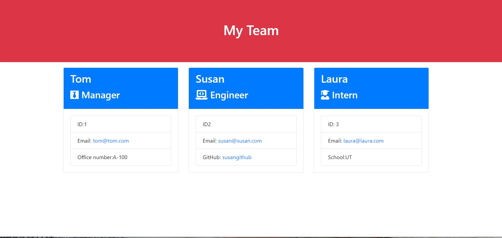

# Team Generator
  ' 
  ## Description
    This is a Node command-line application, that takes in information provided by the user about employees on a software engineering team. Based on the information provided, the app writes the output to an HTML file. It uses the Inquirer package to prompt for questions and collect input from the user, and Jest to help running the tests
  

## Usage
   You start by running node index.js in your command line. It will then show a series of questions regarding the team's employees that need to be answered in order to create your HTML file. 

   Link to the video: https://drive.google.com/file/d/1E6YYLtX4t-MIRbndY9RBPwFRes9iL_Ip/preview

## Screenshot

## Contributing
    Martha Gamez.

## Questions
Link to my GitHub profile: https://github.com/Martha121  
If you have questions please contactme me at: marthagamez211@gmail.com

## License
This application is covered by the MIT license. 
Link: https://opensource.org/licenses/MIT  . 